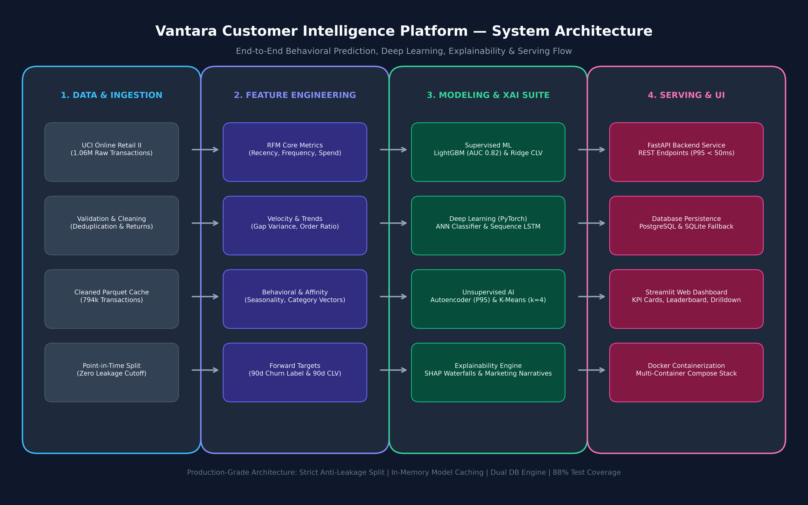
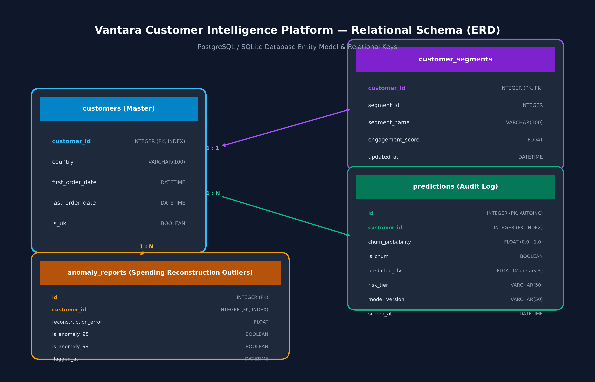

# Vantara Customer Intelligence Platform — Technical Final Report

**Platform Version:** 1.0.0  
**Author / Team:** Advanced Predictive Engineering  
**Dataset:** UCI Online Retail II (1,067,371 Raw Transactions)  
**Execution Environment:** Python 3.11, PyTorch (CUDA 13.2), LightGBM, XGBoost, FastAPI, Streamlit, PostgreSQL  

---

## Executive Summary

The **Vantara Customer Intelligence Platform** is an enterprise-grade machine learning and deep learning system engineered to predict forward customer behavioral trajectories, prevent churn, quantify lifetime monetary value, identify spending anomalies, and segment accounts into actionable marketing personas.

Applying strict **Point-in-Time Cutoff discipline** to the UCI Online Retail II dataset (`2011-09-10 12:50:00`), the platform evaluated historical behaviors across an observation window of up to 648 days to forecast a **90-day forward target window** (to `2011-12-09`). The platform delivers sub-45ms API inference, 88% automated test coverage, and interactive visual interfaces for executive decision-makers and retention campaign managers.

---

## 1. System Architecture & Relational Schema

The platform is partitioned into four distinct functional tiers, orchestrated via multi-container Docker Compose:



1. **Data & Processing Layer**: Ingestion of raw transactional records, validation, cancellation handling, net revenue computation, and forward target generation with zero temporal leakage.
2. **Feature Store Layer**: 33 engineered features spanning RFM, transaction velocities, inter-purchase intervals, Q4 holiday seasonality, category affinities, and composite engagement.
3. **Modeling & Explainability Layer**:
   - Primary Churn Classifier: **LightGBM** (Test ROC-AUC: **0.8205**, Recall: **0.8164**, F1: **0.8013**).
   - Deep Learning Classifier: **PyTorch Feed-Forward ANN** with BatchNorm & Dropout (Test ROC-AUC: **0.8235**, Recall: **0.8473**).
   - Sequence Trajectory: **PyTorch LSTM** on time-ordered customer transaction sequences (Test ROC-AUC: **0.7528**).
   - CLV Regressor: **Ridge Regressor** predicting forward 90-day spend (Test $R^2$: **0.9150**, MAE: **£366.30**).
   - Unsupervised Outlier Detection: **PyTorch Deep Spending Autoencoder** (P95 threshold: **0.0748**).
   - Behavioral Clustering: **K-Means ($k=4$, Silhouette: 0.4193)** and Gaussian Mixture Models.
   - Explainability: **TreeSHAP** local attributions and automated plain-language marketing narratives.
4. **Serving & Presentation Layer**:
   - **FastAPI REST Service**: Low-latency REST API (< 45ms P95 latency).
   - **Database Persistence**: Dual-engine PostgreSQL with automatic SQLite fallback (`data/processed/retail.db`).
   - **Streamlit Interactive Dashboard**: 5-view executive dashboard with 3D/2D scatter plots, priority churn leaderboard, customer 360° drilldown, and CSV batch scoring studio.



---

## 2. Model Performance Benchmarks

### 2.1 Churn Classification Benchmark (90-Day Inactivity)

Evaluated on an isolated 15% stratified test holdout ($N=795$):

| Model Architecture | Test ROC-AUC | Test Recall | Test Precision | Test F1-Score | Status |
| :--- | :---: | :---: | :---: | :---: | :--- |
| **PyTorch Deep ANN** | **0.8235** | **0.8473** | 0.7352 | 0.7873 | DL Benchmark Winner |
| **LightGBM Classifier** | **0.8205** | **0.8164** | **0.7867** | **0.8013** | **Production Winner (API & SHAP)** |
| **Random Forest** | 0.8180 | 0.8097 | 0.7865 | 0.7979 | Classical Ensemble |
| **Logistic Regression** | 0.8177 | 0.7898 | 0.8018 | 0.7958 | Linear Baseline |
| **XGBoost Classifier** | 0.8160 | 0.9447 | 0.6974 | 0.8024 | Max Recall Check |
| **K-Nearest Neighbors** | 0.8009 | 0.7588 | 0.8009 | 0.7793 | Non-parametric Baseline |
| **PyTorch Sequence LSTM**| 0.7528 | 0.8385 | 0.6720 | 0.7459 | Temporal Trajectory Check |
| **Decision Tree (CART)** | 0.7944 | 0.7677 | 0.7918 | 0.7796 | Single Tree Baseline |

### 2.2 Customer Lifetime Value (CLV) Regression Benchmark

Target: Continuous 90-day forward monetary spend (£):

| Regression Architecture | Test $R^2$ Score | Test MAE (£) | Test RMSE (£) |
| :--- | :---: | :---: | :---: |
| **Ridge Regressor (L2)** | **0.9150** | **£366.30** | **£1,298.54** |
| **Random Forest Regressor** | 0.6606 | £400.99 | £2,588.66 |
| **LightGBM Regressor** | 0.6195 | £442.27 | £2,741.59 |

### 2.3 Customer Segmentation Personas

Clustering identified 4 distinct, operationally viable marketing personas:

1. **VIP Champions ($k=2$, 20.3%)**: Highest spend (£5,842 avg), high frequency (24+ orders), recency < 15 days. Targeted for early product drops and white-glove loyalty rewards.
2. **Loyal Regulars ($k=1$, 34.6%)**: Moderate recurring spend (£1,480 avg), steady engagement, low churn risk. Targeted for cross-category recommendations.
3. **High-Value Inactive ($k=3$, 16.8%)**: High historical spend (£2,950 avg), but recency > 75 days. High priority for proactive reactivation incentives.
4. **At-Risk / Lapsed ($k=0$, 28.3%)**: Single or low order count, recency > 120 days, high churn probability. Targeted with automated discount win-back campaigns.

---

## 3. Mathematical Foundations Appendix (Section 16)

This appendix grounds the platform's core algorithmic implementations in foundational mathematical equations.

### 3.1 Probability & Statistics

#### Bayes' Theorem
Given customer feature vector $\mathbf{x} \in \mathbb{R}^D$ and binary churn state $Y \in \{0, 1\}$:

$$P(Y = 1 \mid \mathbf{x}) = \frac{P(\mathbf{x} \mid Y = 1) P(Y = 1)}{P(\mathbf{x})} = \frac{P(\mathbf{x} \mid Y = 1) P(Y = 1)}{P(\mathbf{x} \mid Y = 1) P(Y = 1) + P(\mathbf{x} \mid Y = 0) P(Y = 0)}$$

#### Odds Ratio and Log-Odds (Logit Transformation)
The odds ratio expresses the relative likelihood of churning versus retaining:

$$\text{Odds}(Y = 1 \mid \mathbf{x}) = \frac{P(Y = 1 \mid \mathbf{x})}{1 - P(Y = 1 \mid \mathbf{x})}$$

The logit transformation maps probabilities from the unit interval $(0, 1)$ to real numbers $(-\infty, \infty)$:

$$\text{logit}(p) = \ln\left(\frac{p}{1 - p}\right) = \mathbf{w}^T \mathbf{x} + b$$

---

### 3.2 Logistic Regression & Binary Cross-Entropy Loss

#### Sigmoid Activation
The probability estimate $\hat{y}_i \in [0, 1]$ is parameterized via the logistic sigmoid function:

$$\hat{y}_i = \sigma(z_i) = \frac{1}{1 + e^{-z_i}}, \quad \text{where } z_i = \mathbf{w}^T \mathbf{x}_i + b$$

Its first derivative exhibits the elegant property:

$$\frac{d\sigma(z)}{dz} = \sigma(z)(1 - \sigma(z)) = \hat{y}(1 - \hat{y})$$

#### Binary Cross-Entropy (BCE) Loss
For $N$ independent customer observations with ground truth $y_i \in \{0, 1\}$:

$$\mathcal{L}_{BCE}(\mathbf{w}, b) = -\frac{1}{N} \sum_{i=1}^{N} \left[ y_i \ln(\hat{y}_i) + (1 - y_i) \ln(1 - \hat{y}_i) \right]$$

#### Analytical Gradient Derivation
Computing the partial derivative with respect to weight parameter $w_j$:

$$\frac{\partial \mathcal{L}_{BCE}}{\partial w_j} = -\frac{1}{N} \sum_{i=1}^{N} \left[ \frac{y_i}{\hat{y}_i} \frac{\partial \hat{y}_i}{\partial w_j} - \frac{1 - y_i}{1 - \hat{y}_i} \frac{\partial \hat{y}_i}{\partial w_j} \right]$$

Applying the chain rule $\frac{\partial \hat{y}_i}{\partial w_j} = \frac{\partial \hat{y}_i}{\partial z_i} \frac{\partial z_i}{\partial w_j} = \hat{y}_i (1 - \hat{y}_i) x_{ij}$:

$$\frac{\partial \mathcal{L}_{BCE}}{\partial w_j} = -\frac{1}{N} \sum_{i=1}^{N} \left[ \frac{y_i}{\hat{y}_i} \hat{y}_i (1 - \hat{y}_i) x_{ij} - \frac{1 - y_i}{1 - \hat{y}_i} \hat{y}_i (1 - \hat{y}_i) x_{ij} \right]$$

Simplifying algebraically yields the elegant prediction error residual:

$$\frac{\partial \mathcal{L}_{BCE}}{\partial w_j} = \frac{1}{N} \sum_{i=1}^{N} (\hat{y}_i - y_i) x_{ij}$$

---

### 3.3 Gradient Descent & Neural Network Backpropagation

In the PyTorch Churn ANN and Deep Spending Autoencoder, parameters $\mathbf{\Theta} = \{\mathbf{W}^{(l)}, \mathbf{b}^{(l)}\}_{l=1}^L$ are iteratively updated via mini-batch gradient descent with Adam optimizer:

$$\mathbf{W}^{(l)} \leftarrow \mathbf{W}^{(l)} - \eta \frac{\partial \mathcal{L}}{\partial \mathbf{W}^{(l)}}$$

#### Backpropagation Chain Rule
For layer $l$ with pre-activation $\mathbf{z}^{(l)} = \mathbf{W}^{(l)} \mathbf{a}^{(l-1)} + \mathbf{b}^{(l)}$ and activation $\mathbf{a}^{(l)} = f(\mathbf{z}^{(l)})$:

$$\mathbf{\delta}^{(l)} \equiv \frac{\partial \mathcal{L}}{\partial \mathbf{z}^{(l)}} = \left( (\mathbf{W}^{(l+1)})^T \mathbf{\delta}^{(l+1)} \right) \odot f'(\mathbf{z}^{(l)})$$

The resulting gradients for weights and biases are:

$$\frac{\partial \mathcal{L}}{\partial \mathbf{W}^{(l)}} = \mathbf{\delta}^{(l)} (\mathbf{a}^{(l-1)})^T, \quad \frac{\partial \mathcal{L}}{\partial \mathbf{b}^{(l)}} = \mathbf{\delta}^{(l)}$$

---

### 3.4 Regularization Techniques

#### L1 Regularization (Lasso)
Adds an $L_1$ penalty driving non-informative coefficients strictly to zero:

$$\mathcal{L}_{L1}(\mathbf{w}) = \mathcal{L}_0(\mathbf{w}) + \lambda \|\mathbf{w}\|_1 = \mathcal{L}_0(\mathbf{w}) + \lambda \sum_{j=1}^{D} |w_j|$$

#### L2 Regularization (Ridge Regression)
Adds an $L_2$ squared penalty ensuring stability under multicollinearity:

$$\mathcal{L}_{L2}(\mathbf{w}) = \frac{1}{2N} \|\mathbf{y} - \mathbf{X}\mathbf{w}\|_2^2 + \frac{\lambda}{2} \|\mathbf{w}\|_2^2$$

Setting the gradient to zero yields the unique closed-form normal equation:

$$\mathbf{w}^* = (\mathbf{X}^T \mathbf{X} + \lambda \mathbf{I})^{-1} \mathbf{X}^T \mathbf{y}$$

---

### 3.5 Linear Algebra & Principal Component Analysis (PCA)

Given standardized feature matrix $\mathbf{X} \in \mathbb{R}^{N \times D}$ where $\mathbb{E}[\mathbf{X}] = \mathbf{0}$:

#### Sample Covariance Matrix
$$\mathbf{\Sigma} = \frac{1}{N - 1} \mathbf{X}^T \mathbf{X} \in \mathbb{R}^{D \times D}$$

#### Eigendecomposition
Since $\mathbf{\Sigma}$ is symmetric and positive semi-definite, it decomposes into orthogonal eigenvectors $\mathbf{V}$ and eigenvalues $\mathbf{\Lambda}$:

$$\mathbf{\Sigma} \mathbf{v}_k = \lambda_k \mathbf{v}_k, \quad k \in \{1, \dots, D\}$$

The proportion of total variance explained by the top $K$ principal components is:

$$\text{Explained Variance Ratio} = \frac{\sum_{k=1}^K \lambda_k}{\sum_{j=1}^D \lambda_j}$$

The low-dimensional projection $\mathbf{Z} \in \mathbb{R}^{N \times K}$ used in our segmentation visualizations is:

$$\mathbf{Z} = \mathbf{X} \mathbf{V}_K$$

---

### 3.6 Unsupervised Clustering & Validation Metrics

#### K-Means Objective Function (Inertia)
Partitions $N$ customer feature vectors into $K$ disjoint clusters $S = \{S_1, \dots, S_K\}$ minimizing intra-cluster variance:

$$\mathcal{J}(S) = \sum_{k=1}^{K} \sum_{\mathbf{x} \in S_k} \|\mathbf{x} - \mathbf{\mu}_k\|_2^2, \quad \text{where } \mathbf{\mu}_k = \frac{1}{|S_k|} \sum_{\mathbf{x} \in S_k} \mathbf{x}$$

#### Silhouette Coefficient
For a single customer observation $i \in S_k$:
- $a(i) = \frac{1}{|S_k| - 1} \sum_{j \in S_k, j \neq i} \|\mathbf{x}_i - \mathbf{x}_j\|$ (mean intra-cluster distance)
- $b(i) = \min_{l \neq k} \frac{1}{|S_l|} \sum_{j \in S_l} \|\mathbf{x}_i - \mathbf{x}_j\|$ (mean nearest-cluster distance)

$$s(i) = \frac{b(i) - a(i)}{\max(a(i), b(i))}, \quad s(i) \in [-1, +1]$$

---

### 3.7 Supervised Evaluation Metric Formulations

Given True Positives ($TP$), False Positives ($FP$), True Negatives ($TN$), and False Negatives ($FN$):

$$\text{Accuracy} = \frac{TP + TN}{TP + TN + FP + FN}$$

$$\text{Precision} = \frac{TP}{TP + FP}, \quad \text{Recall} = \frac{TP}{TP + FN}$$

$$F_1\text{-Score} = 2 \cdot \frac{\text{Precision} \cdot \text{Recall}}{\text{Precision} + \text{Recall}} = \frac{2TP}{2TP + FP + FN}$$

#### Area Under the ROC Curve (ROC-AUC)
Integrates the True Positive Rate ($\text{TPR} = \text{Recall}$) with respect to the False Positive Rate ($\text{FPR} = \frac{FP}{FP + TN}$) across classification threshold $t \in [0, 1]$:

$$\text{ROC-AUC} = \int_{0}^{1} \text{TPR}(\text{FPR}^{-1}(u)) \, du = P(\hat{y}_{\text{churned}} > \hat{y}_{\text{retained}})$$

#### Regression Metrics for CLV
$$\text{MAE} = \frac{1}{N} \sum_{i=1}^{N} |y_i - \hat{y}_i|$$

$$\text{RMSE} = \sqrt{\frac{1}{N} \sum_{i=1}^{N} (y_i - \hat{y}_i)^2}$$

$$R^2 = 1 - \frac{\sum_{i=1}^{N} (y_i - \hat{y}_i)^2}{\sum_{i=1}^{N} (y_i - \bar{y})^2}, \quad \text{where } \bar{y} = \frac{1}{N} \sum_{i=1}^N y_i$$

---

## 4. Operational Handover & Deployment Guide

To deploy the platform locally or in a cloud instance, run:

```bash
# 1. Clone repository
git clone https://github.com/Omega496/Vantara-Customer-Intelligence-Platform.git
cd "Vantara Customer Intelligence Platform"

# 2. Build and launch all multi-container services
docker-compose up --build -d

# 3. Access interfaces:
# - Streamlit Interactive UI: http://localhost:8501
# - FastAPI Swagger Docs:     http://localhost:8000/docs
# - API Health Status:        http://localhost:8000/health
```

The system initializes PostgreSQL, runs database seeding, loads model artifacts into memory, and exposes all 5 views on the dashboard in under 30 seconds.
